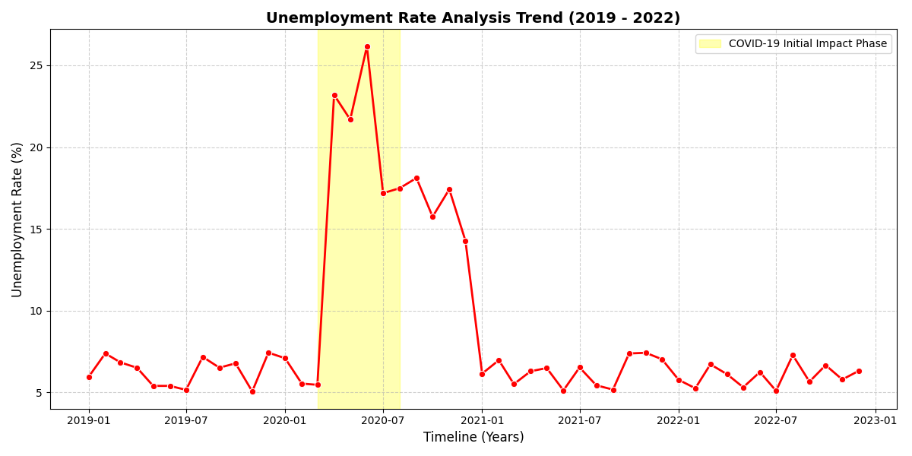

# 📉 Unemployment Analysis with Python

This repository contains a data analysis workflow designed to process, explore, and visualize unemployment trends and track the economic impacts over time.

### 📊 Trend Analysis Chart
Below is the structural visualization graph showcasing the trend tracking:

